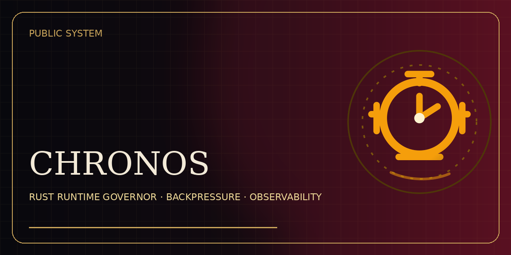
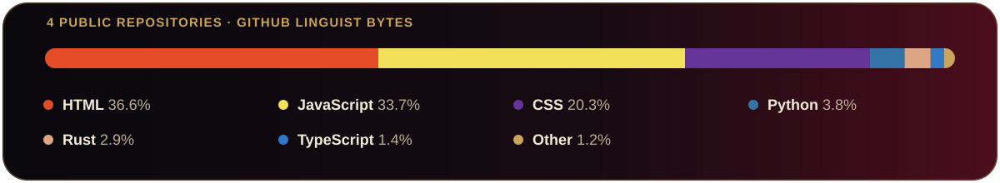
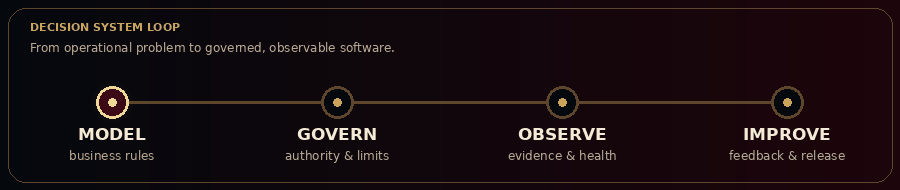

<strong>Business Systems Architect · Full-Stack AI Developer</strong>

I turn operational problems into inspectable software for finance, inventory, AI workloads, and interactive worlds.

  <a href="https://rodolfopr92.github.io/rodolfo-portfolio/">Portfolio</a> ·
  <a href="https://github.com/Rodolfopr92?tab=repositories">Repositories</a> ·
  Florianópolis, Brazil

## Selected public systems

<table>
<tr>
<td width="50%" valign="top">

 
A standalone runtime governor that controls workload admission, queueing, cancellation, and resource observability.
</td>
<td width="50%" valign="top">

 
A browser RPG set in New York in 2018, built around a modular city map, game services, and a governed art-production pipeline.
</td>
</tr>
</table>

## Public portfolio code composition

  

Calculated from GitHub Linguist language bytes across selected public, non-fork repositories. This describes the visible portfolio, not personal proficiency.

## How I work

I began with operations and business problems rather than a preferred framework. I map the decisions, evidence, authority, and failure points first; the stack comes second.

## Decision-system loop

  

## Current direction

I am turning private architectural work into focused public showcases and commercial products while continuing development of **The Quiet Ledger**.
