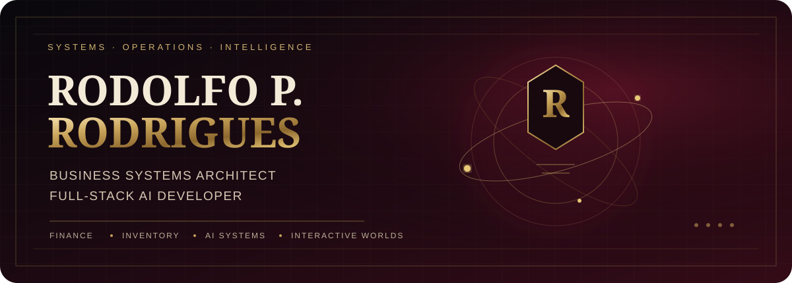
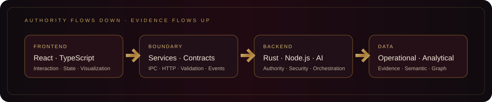
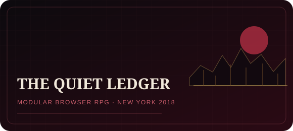
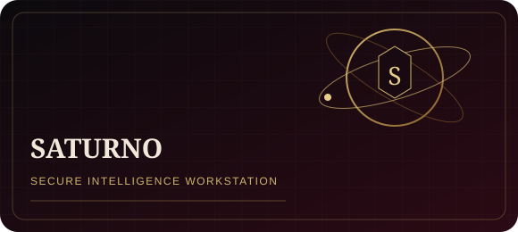
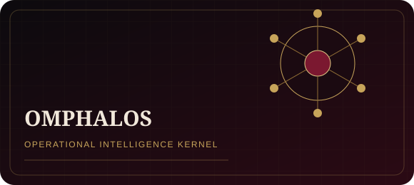
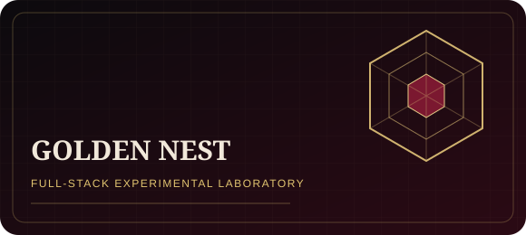

<picture>
  <source media="(prefers-color-scheme: dark)" srcset="./assets/hero-dark.svg">
  <source media="(prefers-color-scheme: light)" srcset="./assets/hero-light.svg">
  
</picture>

<p align="center">
  <strong>Business Systems Architect · Full-Stack AI Developer · Operations Intelligence Builder</strong>
</p>

<p align="center">
  I design systems where business logic, data authority, AI, security, and interface meet.
</p>

<p align="center">
  <a href="https://rodolfopr92.github.io/rodolfo-portfolio/">Portfolio</a>
  ·
  <a href="https://github.com/Rodolfopr92?tab=repositories">Repositories</a>
  ·
  Florianópolis, Brazil
</p>

<br>

<p align="center">
  
</p>

## Selected systems

<table>
  <tr>
    <td width="50%">
      <a href="https://github.com/Rodolfopr92/thequietledger">
        
      </a>
      <br>
      <sub>Modular browser RPG, governed art pipeline, responsive Atlas, services, repositories, contracts, and API foundations.</sub>
    </td>
    <td width="50%">
      
      <br>
      <sub>Private local-first intelligence workstation with typed Rust boundaries, secure secrets, analytical stores, retrieval, and AI orchestration.</sub>
    </td>
  </tr>
  <tr>
    <td width="50%">
      <a href="https://github.com/Rodolfopr92/Omphalos-git">
        
      </a>
      <br>
      <sub>Backend-heavy operational intelligence monolith spanning finance, inventory, ingestion, AI, security, and decision systems.</sub>
    </td>
    <td width="50%">
      <a href="https://github.com/Rodolfopr92/goldennest">
        
      </a>
      <br>
      <sub>Experimental full-stack laboratory connecting React, Tauri, Rust, analytical pipelines, local inference, and business modules.</sub>
    </td>
  </tr>
</table>

## Engineering line

```text
Golden Nest
capabilities distributed across the stack
        ↓
Omphalos
a Rust kernel becomes the operational core
        ↓
Saturno
the renderer becomes untrusted and authority is formalized

Quiet Ledger
the transport itself becomes replaceable through services, ports, and adapters
```

## What I build

| Domain | Work |
|---|---|
| **Finance** | Unit economics, pricing, working capital, scenarios, margin, and decision support |
| **Inventory** | Classification, replenishment, evidence trails, warehouse controls, and operational intelligence |
| **AI systems** | Local and hosted models, retrieval, ingestion, tools, security gates, and resource governance |
| **Interactive products** | Responsive application shells, maps, game interfaces, visual systems, and asset pipelines |
| **Architecture** | Typed contracts, IPC and HTTP boundaries, data authorities, migrations, validation, and auditability |

## Current direction

I am converting private architectural work into focused commercial products for finance, inventory, data migration, and security while continuing development of **The Quiet Ledger**.

<p align="center">
  
</p>

<p align="center">
  <sub>Built as a governed profile system, not a badge cabinet.</sub>
</p>
