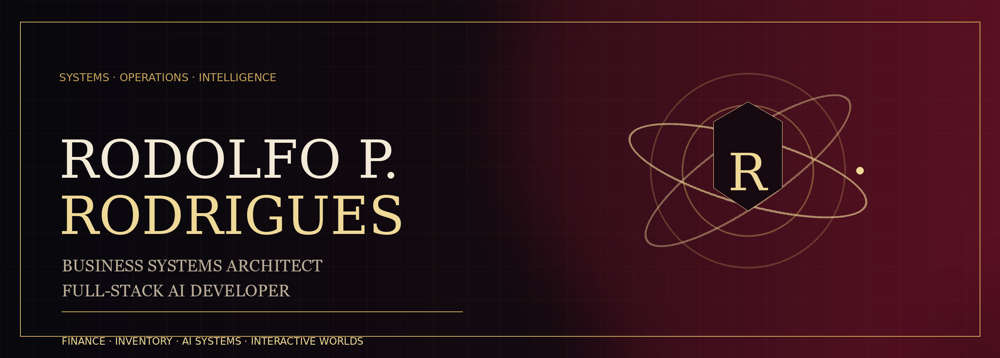
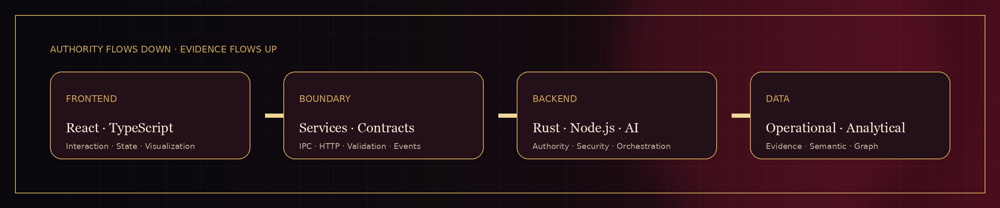
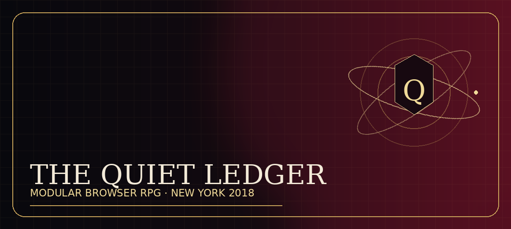
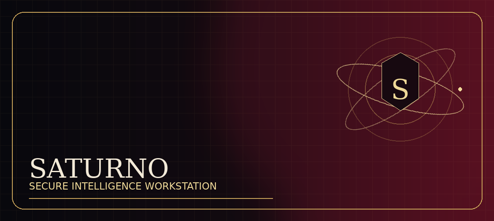
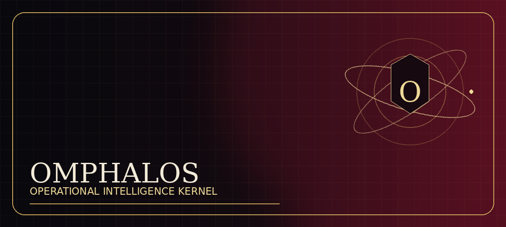
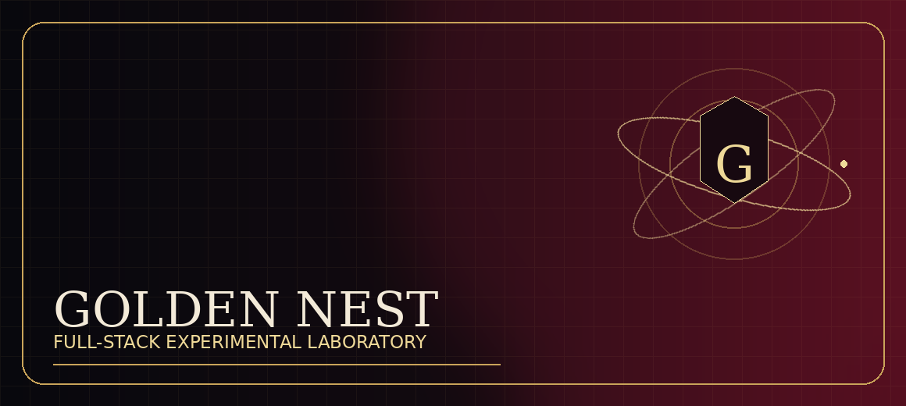

<p align="center"><strong>Business Systems Architect · Full-Stack AI Developer · Operations Intelligence Builder</strong></p>

<p align="center">I design systems where business logic, data authority, AI, security, and interface meet.</p>

<p align="center">
  <a href="https://rodolfopr92.github.io/rodolfo-portfolio/">Portfolio</a> ·
  <a href="https://github.com/Rodolfopr92?tab=repositories">Repositories</a> ·
  Florianópolis, Brazil
</p>

<br>

<p align="center"></p>

## Selected systems

<table>
<tr>
<td width="50%">
<a href="https://github.com/Rodolfopr92/thequietledger"></a>
<br>
<sub>Modular browser RPG, governed art pipeline, responsive Atlas, services, repositories, contracts, and API foundations.</sub>
</td>
<td width="50%">

<br>
<sub>Private local-first intelligence workstation with typed Rust boundaries, secure secrets, analytical stores, retrieval, and AI orchestration.</sub>
</td>
</tr>
<tr>
<td width="50%">
<a href="https://github.com/Rodolfopr92/Omphalos-git"></a>
<br>
<sub>Backend-heavy operational intelligence monolith spanning finance, inventory, ingestion, AI, security, and decision systems.</sub>
</td>
<td width="50%">
<a href="https://github.com/Rodolfopr92/goldennest"></a>
<br>
<sub>Experimental full-stack laboratory connecting React, Tauri, Rust, analytical pipelines, local inference, and business modules.</sub>
</td>
</tr>
</table>

## Add another system

```bash
./brandctl add-system "CASTOR" "FINANCIAL INTELLIGENCE AND UNIT ECONOMICS" "https://github.com/Rodolfopr92/castor" "C"
./brandctl publish "Add Castor"
```

## Current direction

I am converting private architectural work into focused commercial products for finance, inventory, data migration, and security while continuing development of **The Quiet Ledger**.
